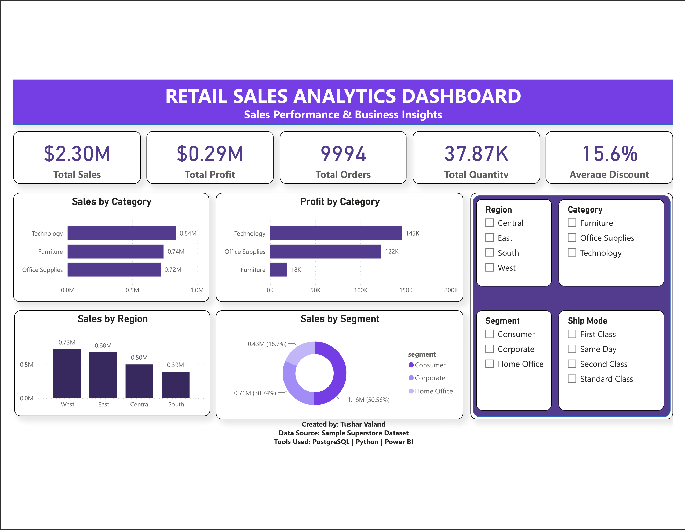
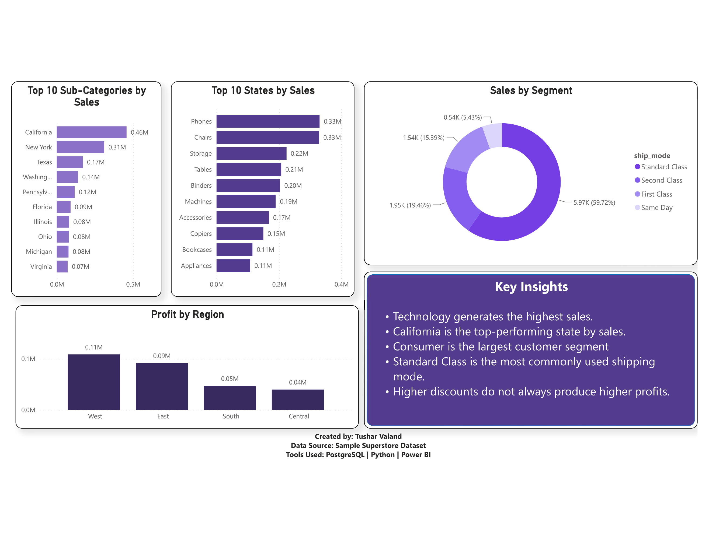

# Retail Sales Analytics

## 📊 Project Overview

This project is an end-to-end Retail Sales Analytics project using the Sample Superstore dataset.

The project analyses sales, profit, customers, products, regions, categories, sub-categories, shipping modes, and discounts to identify important business trends and opportunities.

The analysis combines **Python, SQL/PostgreSQL, and Power BI** to transform raw retail data into meaningful business insights and recommendations.

---

## 🎯 Project Objectives

- Analyse overall sales and profitability
- Identify the most profitable product categories
- Analyse regional sales performance
- Understand customer segment performance
- Identify top-performing states and cities
- Analyse product sub-category performance
- Identify loss-making orders and products
- Analyse the relationship between discounts and profitability
- Build an interactive Power BI dashboard
- Provide data-driven business recommendations

---

## 📁 Dataset

The project uses the **Sample Superstore** dataset.

### Dataset Size

- **Records:** 9,994
- **Columns:** 13

### Main Columns

- Ship Mode
- Segment
- Country
- City
- State
- Postal Code
- Region
- Category
- Sub-Category
- Sales
- Quantity
- Discount
- Profit

---

## 🛠️ Tools & Technologies

### Python
- Pandas
- NumPy
- Matplotlib
- Seaborn
- Jupyter Notebook

### SQL / PostgreSQL
- Data aggregation
- Filtering
- Sorting
- CASE statements
- CTEs
- Subqueries
- Window functions
- Ranking
- Profit margin analysis

### Power BI
- Interactive dashboards
- KPI analysis
- Sales and profit visualisation
- Regional analysis
- Category analysis
- Customer segment analysis
- Product performance analysis

---

## 🔄 Project Workflow

```text
Raw Dataset
     ↓
Data Exploration
     ↓
Python EDA
     ↓
SQL Analysis
     ↓
Business Insights
     ↓
Power BI Dashboard
     ↓
Business Recommendations

```

# 📈 Key Performance Indicators

The project identified the following key performance indicators:

| KPI | Value |
|---|---:|
| 💰 Total Sales | **$2.30M** |
| 📈 Total Profit | **$0.29M** |
| 📦 Total Records | **9,994** |
| 🛒 Total Quantity | **37,873** |
| 🏷️ Average Discount | **15.62%** |
| 💵 Profit Margin | **12.47%** |
| ⚠️ Loss-Making Records | **1,871** |

# 🔍 Key Findings

🏷️ Category Performance

- Technology generated the highest sales and profit.

- Technology generated approximately $836K in sales and $145K in profit.

- Furniture generated approximately $742K in sales but only around $18K in profit.

- Office Supplies generated approximately $719K in sales and $122K in profit.

# 🌎 Regional Performance

The regional analysis identified differences in sales and profitability across the business.

- **West** was the strongest-performing region.
- West generated approximately **$725K in sales** and **$108K in profit**.
- **South** had the lowest sales at approximately **$392K**.

### 💡 Insight

The South region represents an opportunity for targeted marketing, sales strategies, and regional growth initiatives.

---

# 👥 Customer Segment Performance

The analysis identified three major customer segments: Consumer, Corporate, and Home Office.

| Customer Segment | Approx. Sales | Approx. Profit |
|---|---:|---:|
| Consumer | $1.16M | $134K |
| Corporate | $706K | $92K |
| Home Office | $430K | $60K |

### 💡 Insight

The **Consumer** segment generated the highest sales and profit contribution, making it an important segment for customer retention and future growth.

---

# 📦 Product Performance

The analysis identified significant differences in sales and profitability across product sub-categories.

- **Phones** were among the highest-selling sub-categories.
- **Chairs** were also among the highest-selling sub-categories.
- **Tables** generated negative overall profit.
- **Bookcases** showed negative total profit.
- **Supplies** also showed negative total profit.

### 💡 Insight

High sales do not always result in high profitability. Products should therefore be evaluated using both revenue and profit performance.

---

# 📍 Geographic Performance

The state-level analysis identified the highest-performing locations by sales.

- **California** was the top state by sales, generating approximately **$458K**.
- **New York** was the second-highest state by sales, generating approximately **$311K**.

### 💡 Insight

High-performing states can be used as benchmarks, while lower-performing locations can be targeted for improvement.

---

# 💰 Discount & Profitability

Discounts have an important relationship with overall profitability.

- The average discount was approximately **15.62%**.
- **1,871 records** were loss-making.
- Some products and transactions generated negative profit.

### 💡 Insight

High discount levels should be reviewed carefully because excessive discounting can reduce profit margins.

The business should evaluate discounts together with sales, costs, and profit to develop a more effective pricing strategy.

---

# 💡 Business Recommendations

## 1. Review Loss-Making Products

Investigate products and sub-categories such as:

- Tables
- Bookcases
- Supplies

Review their pricing, costs, discounts, and profit margins.

## 2. Optimise Discount Strategy

Analyse high-discount transactions and identify discount levels associated with low or negative profit.

A more controlled discount strategy could help improve overall profitability.

## 3. Continue Investing in Technology

Technology is a major contributor to both sales and profit.

The business should continue focusing on strong-performing Technology products and identify additional growth opportunities.

## 4. Improve South Region Performance

The South region has comparatively lower sales.

Potential strategies include:

- Targeted marketing campaigns
- Regional promotions
- Customer acquisition
- Product-specific campaigns
- Pricing optimisation

## 5. Focus on the Consumer Segment

The Consumer segment generates the largest sales contribution.

Customer retention and targeted marketing strategies could help maintain and grow this segment.

## 6. Monitor Profitability Alongside Sales

Products should not be evaluated based only on revenue.

Both **sales and profit** should be monitored to identify products that generate high revenue but low or negative profitability.

---

# 📊 Power BI Dashboard

The Power BI dashboard provides an interactive view of retail business performance.

### Dashboard Includes

- Total Sales
- Total Profit
- Total Quantity
- Category Analysis
- Sub-Category Analysis
- Regional Analysis
- Customer Segment Analysis
- Shipping Mode Analysis
- Discount Analysis
- Product Performance
- Profitability Analysis

### Dashboard Screenshots

#### Dashboard Page 1



#### Dashboard Page 2



The complete Power BI dashboard file is available in the **Power BI** folder.

---

# 📓 Python EDA

Python was used to perform exploratory data analysis and visualisation.

The Jupyter Notebook contains analysis covering:

- Dataset structure
- Data types
- Missing values
- Category sales
- Category profit
- Regional sales
- Customer segment sales
- Customer segment profit
- Top states by sales
- Top cities by profit
- Product category distribution
- Discount distribution
- Sales distribution
- Profit distribution
- Sales vs Profit analysis
- Sub-category sales analysis

### Python Libraries

- Pandas
- NumPy
- Matplotlib
- Seaborn
- Jupyter Notebook

The complete notebook is available in the **NOTEBOOK** folder.

---

# 🗄️ SQL Analysis

SQL was used to perform structured retail business analysis.

The project contains three levels of SQL analysis.

## Basic SQL Analysis

The basic analysis includes:

- Total sales
- Total profit
- Minimum and maximum values
- Filtering
- Sorting
- Loss-making transactions

## Intermediate SQL Analysis

The intermediate analysis includes:

- Category performance
- Regional performance
- Customer segment analysis
- Top states
- Top cities
- Shipping mode analysis
- CASE statements

## Advanced SQL Analysis

The advanced analysis includes:

- RANK
- DENSE_RANK
- ROW_NUMBER
- Running totals
- Window functions
- CTEs
- Subqueries
- Profit margin analysis
- Business summary analysis

The complete SQL scripts are available in the **SQL** folder.

---

# 📄 Project Report

A detailed project report is included in this repository.

The report covers:

- Executive Overview
- Project Objectives
- Dataset Profile
- Methodology
- Python Exploratory Data Analysis
- SQL Analysis
- Power BI Dashboard
- Key Performance Indicators
- Key Findings
- Business Recommendations
- Skills Demonstrated
- Conclusion

📑 [View Retail Sales Analytics Report](Retail_Sales_Analytics_Report.pdf)

---

# 📁 Repository Structure

```text
Retail-Sales-Analytics/
│
├── DATA/
│   └── SampleSuperstore.csv
│
├── NOTEBOOK/
│   └── retail_sales_eda.ipynb
│
├── SQL/
│   ├── 01_Basic_SQL_Analysis.sql
│   ├── 02_Intermediate_SQL_Analysis.sql
│   ├── 03_Advanced_SQL_Analysis.sql
│   └── database_schema.sql
│
├── IMAGE/
│   ├── dashboard_page1.png
│   └── dashboard_page2.png
│
├── Power BI/
│   └── Power BI Dashboard File
│
├── requirements.txt
├── Retail_Sales_Analytics_Report.pdf
└── README.md
```

# 🧠 Skills Demonstrated

## Data Analytics

- Data Cleaning
- Data Exploration
- Exploratory Data Analysis
- Data Visualisation
- KPI Analysis
- Trend Analysis
- Profitability Analysis
- Business Insights

## Python

- Pandas
- NumPy
- Matplotlib
- Seaborn
- Jupyter Notebook

## SQL / PostgreSQL

- SQL Queries
- Data Aggregation
- Filtering
- Sorting
- GROUP BY
- CASE Statements
- CTEs
- Subqueries
- Window Functions
- RANK
- DENSE_RANK
- ROW_NUMBER
- Running Totals
- Profit Margin Analysis

## Power BI

- Dashboard Development
- Interactive Visualisations
- KPI Development
- Sales Analysis
- Profit Analysis
- Regional Analysis
- Category Analysis
- Customer Segment Analysis
- Product Performance Analysis

## Business Analysis

- Business Problem Solving
- Data-Driven Decision Making
- Business Recommendations
- Performance Analysis
- Profitability Analysis
- Insight Generation
- Business Reporting

---

# 🎓 Project Learning Outcomes

This project provided practical experience across the complete data analytics lifecycle.

### Key Learning Outcomes

1. Worked with a real-world retail sales dataset.
2. Explored and understood business data using Python.
3. Performed exploratory data analysis and data visualisation.
4. Developed SQL queries for business analysis.
5. Applied advanced SQL techniques such as CTEs and window functions.
6. Analysed sales and profitability across different business dimensions.
7. Created an interactive Power BI dashboard.
8. Identified important business trends and performance indicators.
9. Converted analytical findings into actionable business recommendations.
10. Presented the complete analysis as a professional data analytics portfolio project.

---

# ✅ Conclusion

The **Retail Sales Analytics** project demonstrates an end-to-end data analytics workflow, from raw data exploration to business intelligence reporting.

By combining **Python, SQL/PostgreSQL, and Power BI**, the project analyses retail performance across products, categories, regions, customer segments, shipping modes, discounts, sales, and profitability.

The analysis identified strong-performing areas such as **Technology, the West region, and the Consumer segment**, while also highlighting opportunities related to **loss-making products, discount management, and regional performance**.

The project demonstrates the ability to work with raw business data, perform exploratory analysis, develop SQL solutions, build interactive dashboards, identify meaningful insights, and communicate data-driven recommendations.

Overall, this project demonstrates practical skills relevant to **Data Analyst, Business Analyst, Business Intelligence Analyst, and Junior Data Analyst** roles.

---

# 👤 About the Author

## Tushar Chinubhai Valand

**Computer Engineering Graduate | Data Analytics | IT & Technology**

I am interested in **Data Analytics, Business Intelligence, SQL, Python, Power BI, and Business Analysis**.

I enjoy working with data to identify patterns, understand business performance, build interactive dashboards, and develop data-driven solutions.

### Contact & Profiles

📧 **Email:** tusharvaland1326@gmail.com

🔗 **LinkedIn:** https://linkedin.com/in/tushar-valand

🔗 **GitHub:** https://github.com/tusharvaland1326

---

# ⭐ Project

Thank you for visiting this project.

This repository contains the complete **Retail Sales Analytics** workflow, including:

- 📊 Retail sales dataset
- 🐍 Python exploratory data analysis
- 🗄️ SQL/PostgreSQL analysis
- 📈 Power BI dashboard
- 🖼️ Dashboard screenshots
- 📄 Detailed project report
- 💡 Business insights and recommendations

Feel free to explore the repository and review the analysis.

⭐ **If you find this project useful, consider giving the repository a star.**

---

## 📬 Connect With Me

If you are interested in **Data Analytics, Business Intelligence, SQL, Python, or Power BI**, feel free to connect with me.

📧 **Email:** tusharvaland1326@gmail.com

🔗 **LinkedIn:** https://linkedin.com/in/tushar-valand

🔗 **GitHub:** https://github.com/tusharvaland1326
